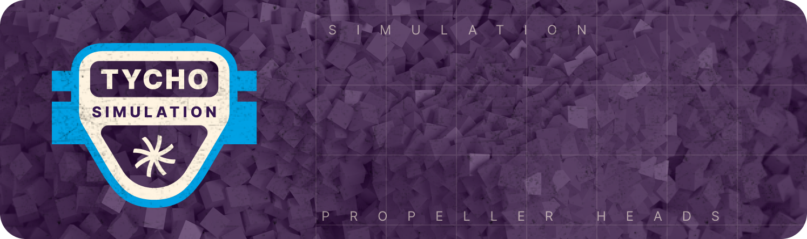

# Tycho Simulation



**Disclaimer: This repository is currently in its alpha release stage and is intended for workshop use only.
It is not production-ready, and we will not ensure backward compatibility at this stage.
A proper launch will follow soon.**

Moves slow on-chain computations off-chain to solve optimization problems.

This crate allows simulating a set of supported protocols off-chain. Currently, it has a focus on token exchange
protocols, but it is not necessarily limited to this.

> **See also:**
> The `evm_simulation` module allows for simulating _any_ transaction; it is agnostic to protocol. See module's
> documentation.

To further help solve hard problems in the context of exchanging tokens, the crate provides the ProtoGraph structure,
which can be queried for chained token exchanges and their parameters. This graph structure evolves over time as
protocol states are changed by user actions. These changes are captured using events. The implemented protocols are
aware of the state-mutating events and can transition their state correctly given such events.

## Currently supported protocols:

- Uniswap V2 and Forks
- Uniswap V3

See also `evm` module which can simulate any transaction.

## Adding a new Protocol

To add a new protocol, you will need to complete the following high-level steps:

1. Create a protocol state struct that implements the `ProtocolSim` struct.
2. _(legacy information)_ Add associated events and implement the transition method on the protocol state struct.

Each protocol should have its own module under `tycho-simulation/src/protocol`.

### 1\. Adding state & behaviour

Simply implement a struct that contains the state of the protocol. Only the attributes that are necessary to fulfill
the `ProtocolSim` trait are required. Then, implement the `ProtocolSim` trait (see [here](src/protocol/state.rs)).

### 2\. Adding Events

_Note: The following section describes a legacy approach that is no longer required for implementing event_transition.
This information is retained for historical context only and should not be used in new implementations._

In previous versions, we need to implement the `event_transition` method.
This method processed events based on metadata from logs, which were particularly tailored for EVM-based chains. If
multiple events were supported by a protocol, they could be grouped into a protocol-specific enum, and converted into
the more generic ProtocolEvent enum.

**Important**: This process is no longer required. The system now handles event transitions more efficiently, so you can
disregard this section for new implementations.

### Local development

1. Please also make sure that the following commands pass if you have changed the code:

```sh
cargo check --all
cargo test --all --all-features
cargo +nightly fmt -- --check
cargo +nightly clippy --workspace --all-features --all-targets -- -D warnings
```

We are using the stable toolchain for building and testing, but the nightly toolchain for formatting and linting, as it
allows us to use the latest features of rustfmt and clippy.

If you are working in VSCode, we recommend you install the [rust-analyzer](https://rust-analyzer.github.io/) extension,
and use the following VSCode user settings:

```json
"editor.formatOnSave": true,
"rust-analyzer.rustfmt.extraArgs": ["+nightly"],
"rust-analyzer.check.overrideCommand": [
"cargo",
"+nightly",
"clippy",
"--workspace",
"--all-features",
"--all-targets",
"--message-format=json"
],
"[rust]": {
"editor.defaultFormatter": "rust-lang.rust-analyzer"
}
```
